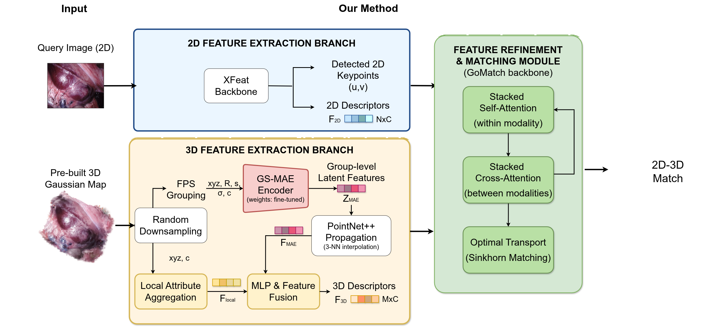
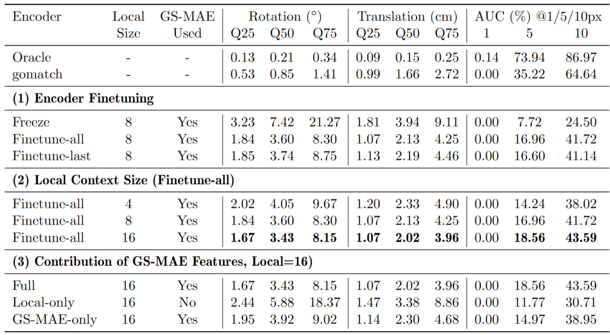
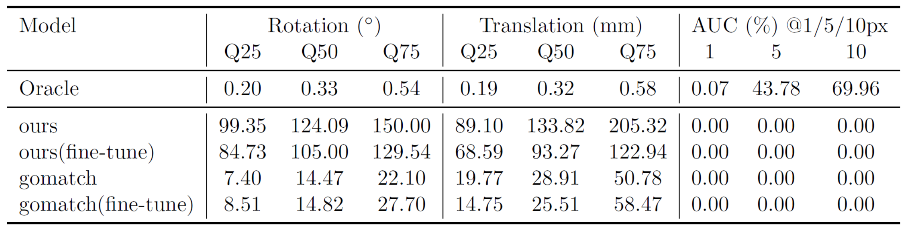

# Learning to Localize on Endoscopic 3D Gaussian Scenes

This repository contains research code from the master thesis **Learning to Localize on Endoscopic 3D Gaussian Scenes**.

The project explores camera relocalization on 3D Gaussian Splatting (3DGS) scenes. Given a query image and a pre-built 3D Gaussian scene, it investigates a correspondence-based localization pipeline that extracts 2D image descriptors and 3D Gaussian descriptors, predicts 2D–3D correspondences, and estimates the camera pose using PnP with RANSAC.

In the thesis, 3DGS-based localization methods are discussed from two practical perspectives: rendering-based pose optimization and correspondence-based pose estimation. This implementation follows the correspondence-based direction, but instead of training or storing additional scene-specific feature attributes inside each Gaussian map, it extracts 3D descriptors directly from standard Gaussian attributes such as position, rotation, scale, opacity, and color.

This project is an exploratory research implementation rather than a published method or a production-ready localization system.


## Method
<p align="center">
  
</p>

The pipeline contains three main components:

### 1. 2D Feature Extraction

The 2D branch uses [XFeat](https://github.com/verlab/accelerated_features) to detect image keypoints and extract local image descriptors from the query image.

Input:

* RGB query image

Output:

* 2D keypoints
* 2D descriptors

### 2. 3D Feature Extraction from Gaussian Splats

The 3D branch extracts per-Gaussian descriptors from a pre-built 3D Gaussian scene.

It contains two feature sources:

- **GS-MAE feature**: the method uses the [GS-MAE / ShapeSplat](https://github.com/qimaqi/ShapeSplat-Gaussian_MAE) architecture and its pretrained weights to extract latent features from the full set of Gaussian attributes, including position, rotation, scale, opacity, and color. GS-MAE is a self-supervised masked autoencoding method for 3D Gaussian representations and provides pretrained representations for downstream tasks.
- **Local Gaussian feature**: local geometric and appearance information is aggregated from neighboring Gaussian primitives, using local position and color information.

The two feature sources are fused to produce the final 3D descriptor for each selected Gaussian primitive.

### 3. 2D–3D Matching and Pose Estimation

The matching module follows a [GoMatch](https://github.com/qianqianwang68/GoMatch)-style feature refinement design:
* self-attention within each modality
* cross-attention between 2D and 3D features
* Sinkhorn-based optimal transport matching
* dustbin entries for unmatched keypoints or Gaussians

The predicted 2D–3D correspondences are then used for camera pose estimation with:

* PnP
* RANSAC

## Repository Structure

```text
.
├── cfg/                         # Configuration files and dataset split files
├── ext/                         # External dependencies and submodule placeholders
├── src/
│   ├── config/                  # Python configuration utilities
│   ├── datasets/                # Dataset loading and geometry utilities
│   ├── evaluations/             # Benchmarking, metrics, and visualization tools
│   ├── experiments/             # Training, preprocessing, and evaluation entry points
│   ├── models/                  # Model definitions
│   │   ├── gomatch/             # GoMatch-style matching modules
│   │   └── gs_mae/              # GS-MAE related modules
│   └── util/                    # Gaussian rendering and helper utilities
├── visualizations/              # Figures used in the README and thesis
├── requirements.txt
└── README.md
```
## Reproducibility Status

This repository is released as a research code archive for a master thesis project. The full training and evaluation pipeline depends on external research components, CUDA extensions, pretrained weights, and datasets that are not included in this repository.

The code was developed in the original research environment and has not been fully verified in a clean installation. Users may need to adapt paths, install external dependencies, and prepare datasets/checkpoints before running the experiments.

## Environment Setup

This codebase was developed based on the environment of [ShapeSplat / Gaussian-MAE](https://github.com/qimaqi/ShapeSplat-Gaussian_MAE). The original experiments used a similar setup with PyTorch, CUDA, and 3D Gaussian Splatting related dependencies.

Clone this repository and initialize submodules:

```bash
git clone <your-repository-url>
cd <repository-name>
git submodule update --init --recursive
```

This repository does not provide a complete `env.yaml` or a fully verified installation script. To set up the environment, please use the ShapeSplat / Gaussian-MAE environment as the starting point and adapt it to your local CUDA and PyTorch versions.

A typical setup workflow is:

```bash
conda create -n gs-localization python=3.9
conda activate gs-localization

pip install -r requirements.txt
```

Depending on which part of the pipeline is used, additional dependencies may be required, including:

* PyTorch with CUDA support
* Gaussian rasterization libraries
* KNN / PointNet++ CUDA operators
* XFeat
* GoMatch-related matching modules
* EndoGaussian preprocessing tools

CUDA-related environment variables used in the original experiments are provided as a reference in:

```bash
cfg/env.sh
```

Please adapt these paths and environment variables to your local machine.


## Data Preparation

This project uses two types of datasets:

### ShapeSplat

[ShapeSplat](https://github.com/qimaqi/ShapeSplat-Gaussian_MAE) is used as the main dataset for training and ablation studies. In this project, the ShapeSplat dataset is used directly, including its provided 3D Gaussian Splatting representations and associated camera views.

For the 2D–3D matching task, query images are rendered from the provided Gaussian scenes using their associated camera poses, rather than from randomly sampled novel viewpoints. This avoids rendering artifacts caused by incomplete Gaussian reconstructions and provides more reliable supervision for correspondence generation.

This project does not reconstruct ShapeSplat scenes from scratch.

### SCARED

[SCARED](https://endovissub2019-scared.grand-challenge.org/) is used for surgical-domain fine-tuning and evaluation. Since SCARED does not provide 3D Gaussian scenes directly, Gaussian scene representations are first reconstructed from the endoscopic sequences using an [EndoGaussian](https://github.com/yifliu3/EndoGaussian)-based preprocessing pipeline.

After reconstruction, timestamp-specific static Gaussian scenes are extracted from the EndoGaussian outputs and used as the 3D scenes for the 2D–3D relocalization experiments.

## Ground Truth Correspondence Generation

The training supervision is generated by constructing reliable 2D–3D correspondences between detected image keypoints and Gaussian primitives.

The process contains three steps:

1. Detect 2D keypoints using XFeat.
2. Backproject keypoints using rendered depth and accumulated rendering weight.
3. Apply surface consistency filtering by snapping valid points to nearby Gaussian centers.

This produces correspondence labels between 2D image locations and 3D Gaussian primitives for training the matching network.


## Running Experiments

The main experiment scripts are located in `src/experiments/`, and the evaluation benchmark scripts are located in `src/evaluations/benchmark/`.

Run the commands from the `src/` directory:

    cd src

### Training

The main training entry point is:

    python -u -m experiments.08_train --name best

The `--name` argument selects an experiment configuration from `config/config_shapesplat.yaml`.

For example, `--name best` loads the final ShapeSplat configuration selected from the ablation study.

Main experiment configurations include:

- `best`: final ShapeSplat configuration
- `scared`: fine-tuning on SCARED with the proposed matcher
- `gomatch`: GoMatch baseline on ShapeSplat
- `scaredgomatch`: GoMatch baseline / fine-tuning on SCARED

Additional configurations such as `A1`, `A2`, `A3`, `A3_2`, `D1`, `D3`, `C1`, and `C2` correspond to the ablation studies described in the thesis.

Before running training, update the dataset paths, checkpoint paths, and output directories in the configuration files.

### Evaluation

Evaluation scripts are located in:

    src/evaluations/benchmark/

Run the benchmark scripts from the `src/` directory after preparing the required datasets and checkpoints.

For example:

    python -u -m evaluations.benchmark.<benchmark_script_name>

Replace `<benchmark_script_name>` with the specific benchmark script you want to run.

The evaluation follows the visual localization metrics used in the thesis, including rotation error, translation error, reprojection accuracy, and AUC under different reprojection thresholds. Pose estimation is performed with PnP and RANSAC.

### Notes

This repository is a research code archive. The scripts depend on prepared datasets, pretrained weights, external repositories, and CUDA extensions. The commands above reflect the original experiment workflow, but a clean installation on a new machine has not been fully verified.

### Preprocessing and Utility Scripts

Additional preprocessing scripts, such as XFeat inference, dataset splitting, and ground-truth correspondence generation, are located in `src/experiments/`.

These scripts are used to prepare intermediate files before training. Their exact usage depends on the dataset and local path configuration. See `src/experiments/README.md` for more details.

## Results and Limitations

The method was evaluated on ShapeSplat and SCARED.

On ShapeSplat, the ablation study showed that the best configuration uses full fine-tuning of the GS-MAE encoder, a local Gaussian context size of 16, and fusion of GS-MAE latent features with local Gaussian features.

On SCARED, the method showed limited generalization to surgical endoscopic scenes. Fine-tuning improved the proposed model slightly, but the overall performance remained weak. A key failure mode is that the model may predict many matches while only a small fraction are valid inliers for PnP.

Main limitations include:

- domain gap between ShapeSplat object scenes and endoscopic images
- incomplete or noisy Gaussian reconstructions in surgical scenes
- low inlier ratios despite high predicted match counts
- sensitivity to reconstruction artifacts

<details>
<summary>ShapeSplat ablation results</summary>

<p align="center">
  
</p>

</details>

<details>
<summary>SCARED evaluation results</summary>

<p align="center">
  
</p>

</details>

## Acknowledgements and External Components

This project builds upon several external research components and datasets, including:

* **3D Gaussian Splatting**: scene representation
* **XFeat**: 2D keypoint detection and image descriptor extraction
* **GoMatch**: basis for the 2D–3D attention-based matching module
* **EndoGaussian**: reconstruction of Gaussian scenes from endoscopic sequences
* **ShapeSplat**: object-centric 3D Gaussian dataset used for training and evaluation
* **SCARED**: surgical endoscopic dataset used for medical-domain evaluation

Please follow the licenses of the corresponding projects and cite their original papers when using these components or datasets.


## License

This repository is released for academic and research purposes. Please also follow the licenses of the external components and datasets used in this project.
